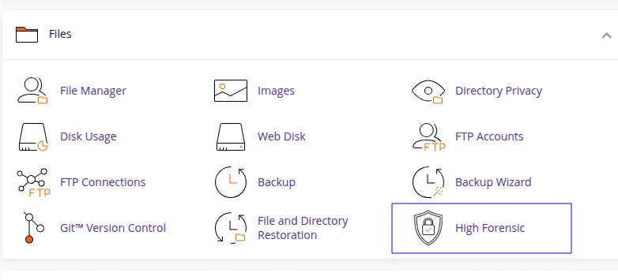
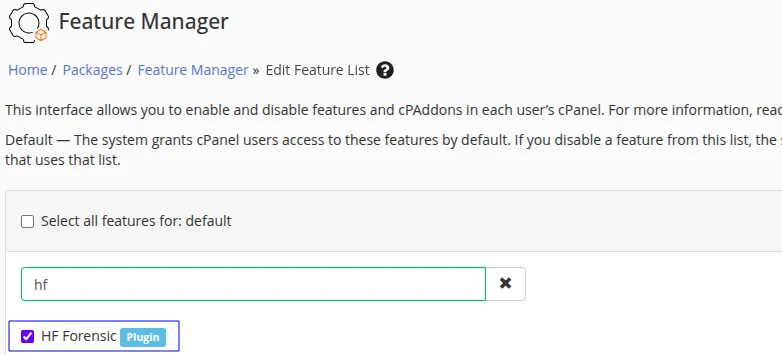
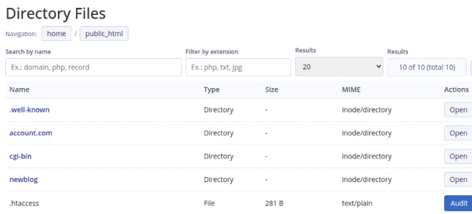
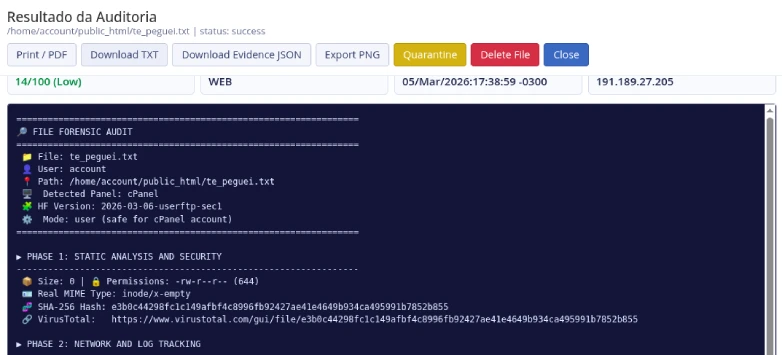
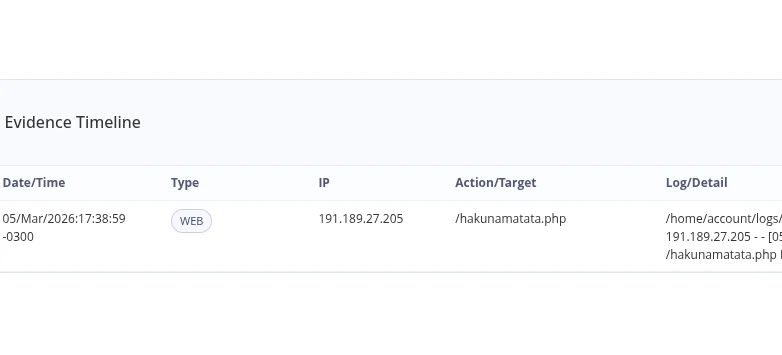
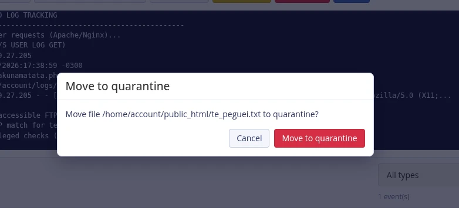
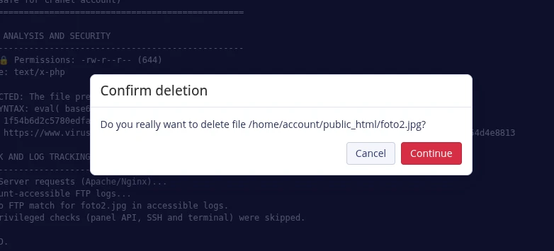
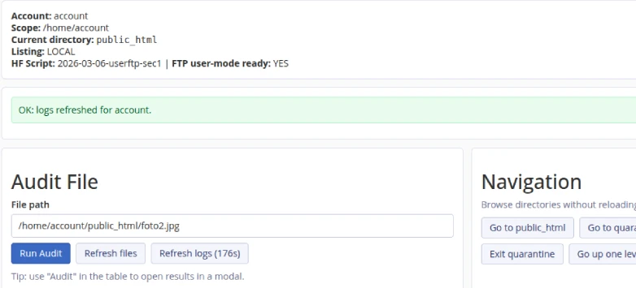

# High Forensic cPanel plugin (`hforensic`)

Readme: [BR](README.md)

  


High Forensic is a cPanel plugin for account-level file forensics. It lets a
cPanel user inspect files under their own home directory, run evidence-focused
analysis using `hf.sh`, refresh account web logs safely, and quarantine or
restore suspicious files.

This repository contains the complete plugin package used by
`/usr/local/cpanel/scripts/install_plugin`.

## Overview

High Forensic is designed for shared hosting environments where the cPanel user
must not receive privileged host access. The plugin uses a strict
account-scoped model:

- File browsing is limited to `/home/<cpanel_user>`.
- Audits run in unprivileged mode (`hf.sh --mode=user`).
- Log refresh is delegated through a constrained sudo wrapper.
- Quarantine operations are restricted to the account-owned metadata area.

The menu entry appears under **Files** as **High Forensic**.

## Screenshot










## Repository layout

The package structure is:

```text
cpanel-hf-plugin/
├── install.json
├── meta.json
├── hf-icon.png
├── hforensic/
│   ├── forensic.php
│   ├── forensic.live.php
│   └── bin/
│       └── run_hforensic.sh
└── scripts/
    ├── install.sh
    ├── one_shot_install.sh
    ├── uninstall.sh
    ├── one_shot_uninstall.sh
    └── hf-runweblogs-safe.sh
```

## Key features

High Forensic provides:

- Account file listing with directory navigation.
- File audit execution from the UI (modal output).
- Evidence timeline and risk summary extracted from audit output.
- Export options:
  - Print/PDF
  - TXT output
  - Evidence JSON
  - PNG snapshot
- Quarantine workflow:
  - Move file to quarantine
  - Restore from quarantine
  - Delete file
- Log refresh using `runweblogs` through a safe wrapper.
- Automatic UI language (English and Portuguese) based on cPanel account
  locale.

## Runtime architecture

High Forensic uses three runtime layers:

1. **UI/API layer**: `hforensic/forensic.live.php`
2. **Audit runner**: `hforensic/bin/run_hforensic.sh`
3. **Audit engine**: global `hf.sh` at `/usr/local/bin/hf.sh`

`forensic.php` is a compatibility redirect to `forensic.live.php` so direct
URLs keep working while preserving cPanel `.live.php` integration behavior.

## Requirements

The plugin requires:

- cPanel server with Jupiter theme installed.
- Root access for install/uninstall operations.
- `tar`, `bash`, and standard GNU coreutils.
- `curl` or `wget` for downloading `hf.sh` (default install flow).
- `visudo` is optional but recommended for sudoers validation.

## Installation

Use the package installer for production deployments.

### Install from plugin tarball (recommended)

Run:

**1. See Release**

Get releases in https://github.com/sr00t3d/cpanel-hf-plugin/releases/tag/production

**2. Download to your server**

```bash
wget https://github.com/sr00t3d/cpanel-hf-plugin/releases/download/production/cpanel-hf-plugin.tar.gz
```

**3. Install**

```bash
PKG="cpanel-hf-plugin.tar.gz" && tar -xOf "$PKG" scripts/one_shot_install.sh | bash -s -- --package "$PWD/$PKG" --theme jupiter
```

**4. Enable**

Acess `WHM > Home > Packages > Feature Manager > Choose a feature > Enable High Forensic`

Optional flags:

- `--hf-url <URL>`: override the `hf.sh` source URL.
- `--hf-sha256 <sha256>`: enforce a specific `hf.sh` checksum.
- `--global-hf /usr/local/bin/hf.sh`: change global `hf.sh` target path.
- `--no-global-hf`: skip download and require existing valid `hf.sh`.
- `--no-restart`: skip graceful `cpsrvd` restart.

### Install from extracted source tree

From repository root:

```bash
bash scripts/install.sh --theme jupiter
```

## Uninstallation

### Uninstall from tarball

Run:

```bash
PKG="cpanel-hf-plugin.tar.gz" && tar -xOf "$PKG" scripts/one_shot_uninstall.sh | bash -s -- --package "$PWD/$PKG" --theme jupiter
```

### Uninstall from extracted source tree

From repository root:

```bash
bash scripts/uninstall.sh --theme jupiter
```

## What the installer writes

The installer creates or updates:

- `/usr/local/cpanel/base/frontend/jupiter/hforensic/`
- `/usr/local/bin/hf.sh` (downloaded from configured source URL)
- `/usr/local/bin/hf-runweblogs-safe`
- `/etc/sudoers.d/hforensic_runweblogs`

It also registers the plugin via:

- `/usr/local/cpanel/scripts/install_plugin`

## Feature manager integration

`install.json` sets:

- `id`: `hforensic`
- `name`: `High Forensic`
- `group_id`: `files`
- `featuremanager`: `true`
- `feature`: `hforensic`
- `uri`: `hforensic/forensic.php`

This lets server admins enable or disable access using cPanel Feature Manager.

## Security model

Security controls are implemented in each layer.

### Package and install hardening

- Tarball entry validation blocks absolute paths and traversal (`..`) entries.
- Installer requires root.
- `hf.sh` checksum verification is supported (`--hf-sha256`).
- `hf.sh` marker validation enforces expected capabilities before activation.

### UI/API hardening (`forensic.live.php`)

- CSRF protection for state-changing actions.
- HTTP method enforcement per action.
- Account detection and strict user validation.
- Path normalization and null-byte rejection.
- Scope checks prevent access outside `/home/<cpanel_user>`.
- Symlink rejection for sensitive file operations.
- Quarantine index integrity validation using HMAC signatures.
- Security headers:
  - `X-Content-Type-Options: nosniff`
  - `Referrer-Policy: same-origin`
  - `X-Frame-Options: SAMEORIGIN`
- Output escaping for HTML and JavaScript rendering paths.

### Runner hardening (`run_hforensic.sh`)

- User name validation with strict regex.
- Requires target file to exist and resolve within `/home/<cpanel_user>/`.
- Enforces maximum file size (`10 MiB`).
- Rejects outdated or incompatible `hf.sh` builds.
- Executes `hf.sh` in unprivileged user mode.

### Log refresh hardening (`hf-runweblogs-safe.sh`)

- Root-only execution through sudo.
- Invoker must match target account (`SUDO_USER == CP_USER`).
- Runs only `/usr/local/cpanel/scripts/runweblogs <cp_user>`.
- Per-user lock and stamp files prevent concurrent abuse.
- Minimum interval enforced (default `180` seconds).

## Anti-spam behavior for refresh actions

High Forensic implements refresh throttling at two levels:

- Backend rate limit for `refresh_logs`: 180 seconds per account/action.
- Frontend cooldown on **Refresh logs** with visible countdown on the button.

This prevents production abuse from repeated log refresh requests.

## Data storage

Per-account metadata is stored under:

- `/home/<cpanel_user>/.hforensic/`

This includes:

- Quarantine directory: `quarantine/`
- Quarantine index metadata
- Local state files (for example, refresh throttle state)

Directories are created with restrictive permissions (`0700`) when possible.

## Language behavior

The UI auto-selects English or Portuguese based on cPanel account locale.
Language is propagated to `hf.sh` so audit output matches the account language
context.

## Operational limitations

Current design intentionally limits scope:

- Account-only forensic analysis (not root-level system forensics).
- Logs are limited to data available to the account in user mode.
- The plugin currently targets Jupiter theme deployments.

## Troubleshooting

Common validation commands:

```bash
/usr/local/cpanel/3rdparty/bin/php -l \
  /usr/local/cpanel/base/frontend/jupiter/hforensic/forensic.live.php

visudo -cf /etc/sudoers.d/hforensic_runweblogs

ls -la /usr/local/cpanel/base/frontend/jupiter/hforensic
```

If the UI does not reflect recent JavaScript changes, force-refresh the page
with `Ctrl+F5`.

## Build package

From repository root:

```bash
tar -czf cpanel-hf-plugin.tar.gz \
  install.json meta.json README.md LICENSE hf-icon.png hforensic scripts
```

## cPanel developer review context

This plugin is intended for production-safe account forensics inside cPanel and
uses cPanel-native integration points:

- `install_plugin` / `uninstall_plugin`
- Jupiter frontend delivery via `.live.php`
- Feature Manager integration
- Controlled `runweblogs` orchestration

A cPanel developer license is useful to validate compatibility against multiple
version tracks and integration scenarios before broader release.

## Legal Notice

> [!WARNING]
> This software is provided "as is". Always ensure you have explicit permission before running. The author is not responsible for any misuse, legal consequences, or data impact caused by this tool.

## Detailed Tutorial

For a complete, step-by-step guide, check out my full article:

👉 [**Make users audit files upload in cPanel**](https://perciocastelo.com.br/blog/make-users-audit-files-upload-in-cpanel.html)

## License

This project is licensed under the **GNU General Public License v3.0**. See the [LICENSE](LICENSE) file for details.